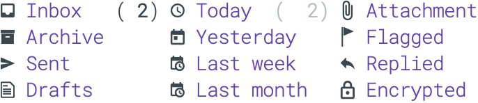

<!--
   N.Rougier —
   Bordeaux</code>
-->

<pre align="center">
<strong>Nicolas P. Rougier /</strong> <a href="https://www.labri.fr/perso/nrougier">Homepage</a> / <a href="https://github.com/rougier/blog">Blog</a> / <a href="https://twitter.com/NPRougier">Twitter</a> / <a href="https://github.com/rougier">GitHub</a> /  <a href="https://gist.github.com/rougier">Gist</a>
</pre>

> I’m a researcher and team leader at the Institute of
> Neurodegenerative Diseases (Bordeaux, France). I’m investigating
> decision making, learning and cognition using computational models
> of the brain. Beside neuroscience, I’m also interested in open and
> reproducible science, scientific visualization, and computer
> graphics. And when I've time, I hack GNU Emacs.
  
## Posts
<!--   
- [**Nerd fonts and mu4e dashboard**]()  
  
  
  
  
  
  

  > 
  
  > I’ve been playing with [nerd fonts](https://www.nerdfonts.com/) and [mu4e dashboard](https://github.com/rougier/mu4e-dashboard) to design a simple mail side panel. The idea is to replace the default [mu4e](https://www.djcbsoftware.nl/code/mu/mu4e.html) homepage with something more compact and visually nicer.  

-->

### [**Using a GitHub repository as a blog**](./posts/github-blog.md)

  
  
  

  > I’m too lazy to setup a real blog and this is the reason why I'm using Github README as a simple blog system. Nothing is automatized but the manual workload is not too high either. Comments are made through issues and tags are issue labels.
  
